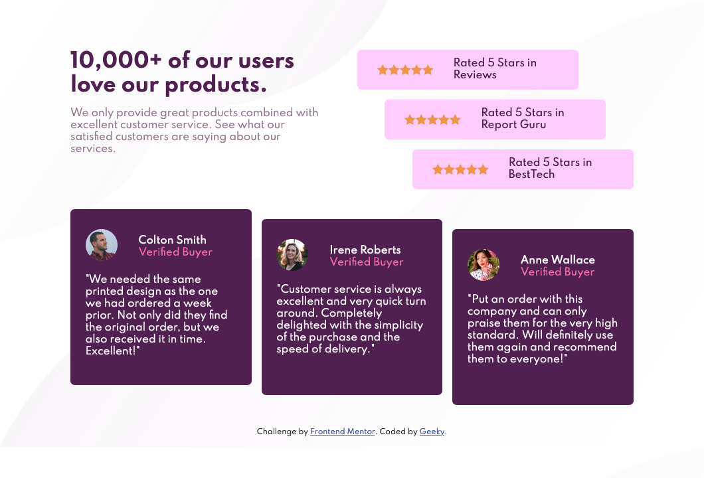

# Frontend Mentor - Social proof section solution

This is a solution to the [Social proof section challenge on Frontend Mentor](https://www.frontendmentor.io/challenges/social-proof-section-6e0qTv_bA). 

## Table of contents

- [Overview](#overview)
  - [The challenge](#the-challenge)
  - [Screenshot](#screenshot)
  - [Links](#links)
- [My process](#my-process)
  - [Built with](#built-with)
- [Author](#author)
- [Acknowledgments](#acknowledgments)

## Overview

### The challenge

Users should be able to:

- View the optimal layout for the section depending on their device's screen size

### Screenshot

### Links

- [Solution URL](https://github.com/dev-praneet/social-proof-section-master)
- [Live Site URL](https://dev-praneet.github.io/social-proof-section-master/)

## My process

### Built with

- Semantic HTML5 markup
- Flexbox

## Author

- Frontend Mentor - [@geeky-amat](https://www.frontendmentor.io/profile/geeky-amat)
- Twitter - [@\_\_dev_praneet\_\_](https://twitter.com/__dev_praneet__)

## Acknowledgments

For the most part, I got my doubts resolved from online websites and youtube videos.
